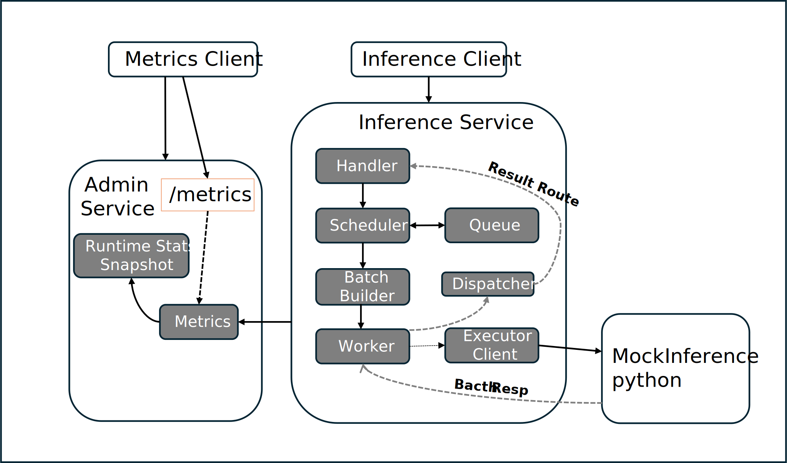
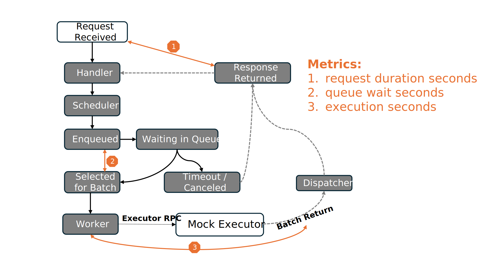
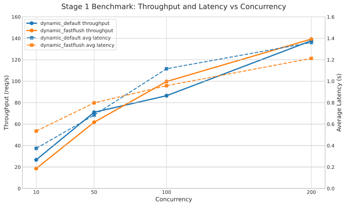

# Stage 1 Report

[中文版本](./stage1_zh.md)

## Summary

Stage 1 establishes a working LLM serving pipeline in `mini-llm-serve`. The system accepts inference requests through a Connect-based gateway, places them into a FIFO queue, forms batches with timeout-based dynamic batching, dispatches execution through a Go worker, and forwards batches to a Python mock executor.

The goal of Stage 1 is not to build an inference engine. Instead, it is to validate the serving pipeline, scheduler behavior, observability surface, and benchmark methodology. At the end of this stage, the project already has a complete request path, runtime metrics, admin endpoints, benchmark tooling, and a documented baseline for future scheduler evolution.

## Key Takeaways

- Stage 1 establishes a working serving pipeline with FIFO queueing and timeout-based dynamic batching.
- Dynamic batching improves throughput substantially over the no-batching baseline.
- Batch size is shaped jointly by arrival rate and batching timeout, creating a measurable throughput-latency tradeoff.
- FIFO is a reasonable Stage 1 baseline, but it does not account for request cost, prompt length, or token-level scheduling.

## Architecture

The Stage 1 architecture separates the system into three planes. The inference plane handles request admission, queueing, batching, execution dispatch, and result routing. The admin plane exposes runtime stats and `/metrics`. The execution backend is represented by a separate Python mock executor, which makes the scheduler-executor boundary explicit.

This separation is important because it keeps the serving control flow understandable. The Go side owns request lifecycle management, batching, observability, and error handling, while the Python side only simulates model execution and returns batch results.

## Request Lifecycle and Batching

The request lifecycle is divided into three observable stages. `request_duration_seconds` covers the full end-to-end path from request arrival to response return. `queue_wait_seconds` measures how long a request waits after enqueueing before being selected into a batch. `execution_seconds` measures backend execution time after the worker issues the executor RPC.

This lifecycle model is useful because it separates scheduler-induced latency from backend execution latency. It also makes timeout, cancellation, and response routing behavior easy to explain.

The batching policy is driven by two flush conditions: batch size and batch timeout. A batch is flushed immediately when the queued request count reaches the configured batch size, or when the oldest queued request has waited longer than the configured batching timeout.

These two conditions solve different problems. Batch size allows the system to capitalize on bursty traffic and improve batching efficiency under load. Batch timeout prevents requests from waiting indefinitely under sparse traffic. Together they create the main Stage 1 throughput-latency tradeoff.

## Benchmark Results

The benchmark results show that dynamic batching changes both throughput and latency in a measurable way.

Compared with the no-batching baseline, dynamic batching improved throughput substantially. In the current workload, `baseline_no_batching` reached `10.26 req/s`, while `dynamic_default` reached `67.22 req/s` and `dynamic_fastflush` reached `71.06 req/s`.

The concurrency sweep shows the expected batching tradeoff. As concurrency increases, the system forms larger batches and achieves higher throughput, but queue wait and end-to-end latency also increase. Under the current mock workload, `dynamic_fastflush` generally provides a better balance than `dynamic_default`, because it reduces queue wait enough to offset the slightly smaller average batch size.

For detailed benchmark tables and raw observations, see [Stage 1 Benchmark Notes](../benchmarks/stage1_en.md).

## Limitations and Next Step

FIFO is a strong Stage 1 baseline because it is simple, observable, and easy to validate. However, it also has clear limitations. It does not differentiate between requests with different urgency levels or execution costs, and it ignores prompt length and request size. Under more realistic workloads, this can lead to head-of-line blocking, where short requests wait behind long or expensive ones.

The next step is therefore not “more FIFO tuning,” but a move toward LLM-aware scheduling. The two most important directions are token-budget-based scheduling and prefill/decode separation. These will allow the scheduler to reason about request cost more accurately and provide the foundation for streaming, cache-aware scheduling, and more realistic serving behavior.

